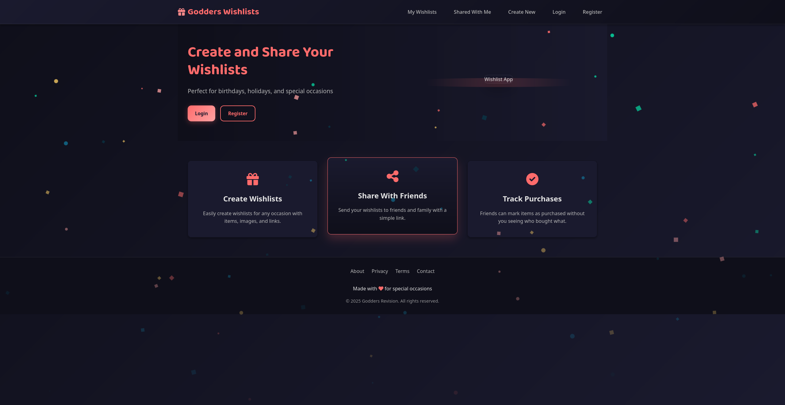
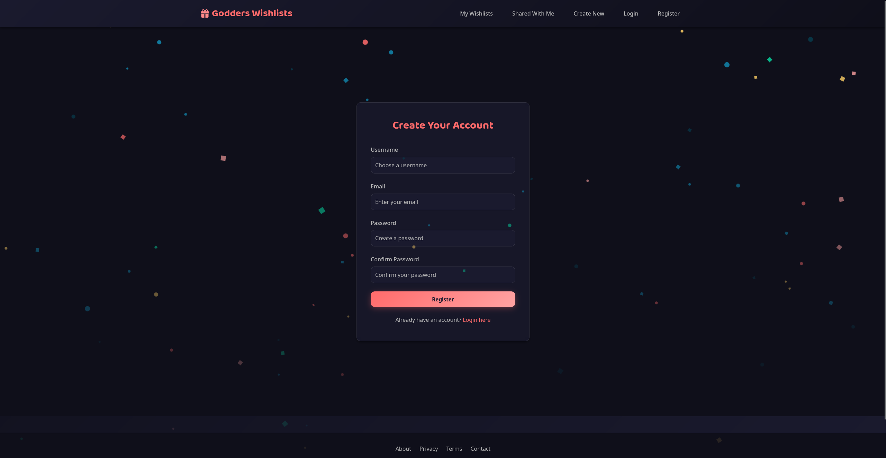
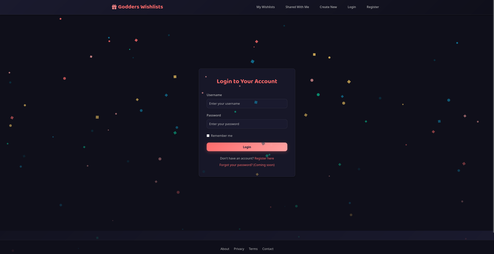
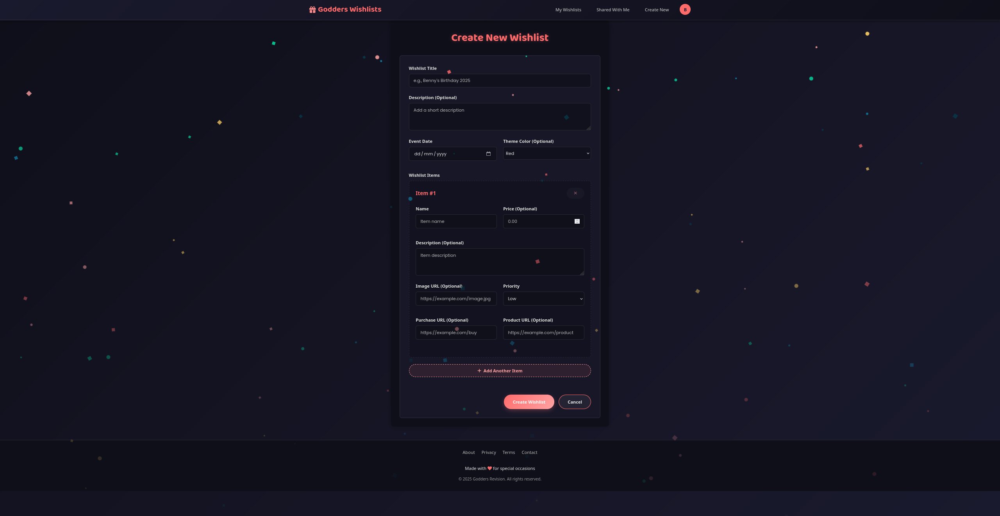

# 🎁 Godders Wishlist

**The smarter way to share gift ideas.**  
Plan events, build wishlists, and share with friends and family — all without spoiling the surprise.

🌐 Live now at: [wishlist.bgodfrey.org](https://wishlist.bgodfrey.org)

---

---

## ✨ What is Godders Wishlist?

**Godders Wishlist** is a sleek, secure wishlist platform that lets you:

- 🎉 Create beautiful, custom gift lists for birthdays, holidays, or any special event  
- 🤝 Share lists with family and friends via email  
- ✅ Let others "claim" items so you don’t get duplicates  
- 🔒 Keep everything private, secure, and totally in your control

It’s designed to be **simple for you** and **helpful for others** — no accounts needed to view or claim gifts.

---

## 🚀 Try It Out

Head to **[wishlist.bgodfrey.org](https://wishlist.bgodfrey.org)** and:

1. **Sign up** (free, fast, no nonsense)
2. **Create a wishlist** — name it, set the date, add a theme
3. **Add items** with images, links, prices, and priority levels
4. **Share it** with anyone via email — they don’t need an account!
5. **Sit back and relax** as people choose gifts without ruining surprises

---

## 🎯 Features You'll Love

| 🎁 Feature                 | 🧠 What It Does                                                  |
|---------------------------|------------------------------------------------------------------|
| ✍️ Smart Wishlist Builder | Add unlimited items with links, prices, images & priorities     |
| 📆 Event Countdown        | Know how many days until each wishlist event                    |
| 🔗 Share by Email         | Invite friends & family with a personal message                 |
| 👀 Invisible Gifting      | Claim items without alerting the wishlist owner (no spoilers!)  |
| 🔒 Secure Access          | Wishlists are private by default — you choose who sees them     |
| 🧠 Dashboard View         | See upcoming events at a glance                                 |

---

## 🔍 Why Use It?

Other platforms are cluttered or require everyone to make an account.  
**Godders Wishlist is lightweight, friendly, and focused on the one thing that matters: thoughtful gifting.**

Use it for:

- Birthdays 🎂  
- Christmas 🎄  
- Baby showers 👶  
- Weddings 💍  
- Secret Santa 🎅  
- Or just to drop a subtle hint 😉

---

## 📸 Sneak Peek

---

## 🔧 Powered By

- **Flask + Python** backend
- **SQLite** for fast, lightweight data storage
- **WTForms** for secure form handling
- **Custom Jinja templates** with mobile-friendly layouts
- Optional **Cloudflare Tunnel** for secure HTTPS hosting
